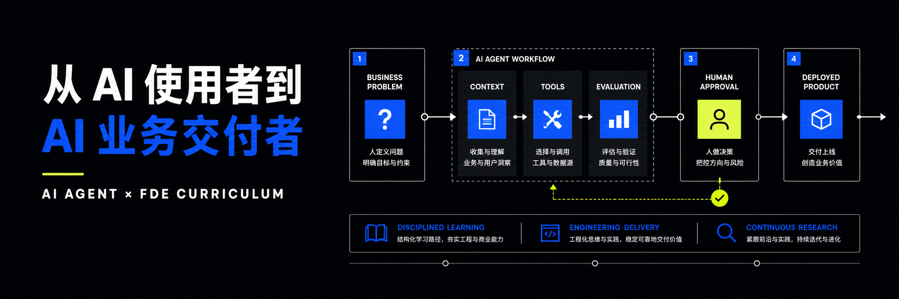
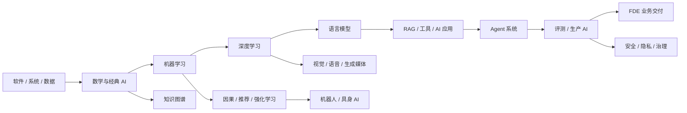

# 从 AI 使用者到 AI 业务交付者

<p align="center">
  
</p>

一套面向转型者的长期、开放、项目驱动 AI 课程。目标不是记住某个框架，而是形成从计算机基础、模型原理到生产交付的完整能力，并能进入企业现场让 AI 从“能演示”走向“能上岗”。

> **What I cannot create, I do not understand.** 课程借鉴 [Build Your Own X](https://github.com/codecrafters-io/build-your-own-x) 的构建式学习与 [OSSU Computer Science](https://github.com/ossu/computer-science) 的先修课程体系：每门课都要回答“我能否解释、亲手构建、测试并交付它”。

## 课程速览

- **完整主线：**约 108 周，建议每周 12-15 小时，适合用约两年系统学习。
- **灵活选课：**先完成共同基础，再按 AI Builder、模型工程、多模态或研究方向组合课程。
- **双项目制：**每门课同时包含一个“从零构建”项目和一个“真实交付”任务。
- **AI 可用但不可绕过理解：**允许 Codex、Claude Code 等工具参与开发，但学习者必须能够解释、调试、评测和承担结果。
- **持续更新：**稳定原理按年复审，工程实践按季度复审，研究雷达按周收集候选论文。

### 三种学习节奏

| 路线 | 每周投入 | 建议周期 | 适合谁 |
| --- | ---: | ---: | --- |
| 深度路线 | 12-15 小时 | 约 24-27 个月 | 希望系统转型，并完成 1-2 门选修 |
| 转岗路线 | 18-20 小时 | 约 16-18 个月 | 优先 AI 应用、Agent、FDE，基础课压缩但不跳过验收 |
| 在职路线 | 8-10 小时 | 约 30-36 个月 | 边工作边学习，以真实工作项目替代部分练习 |

课程时长是建议学习量，不是强制学期。满足先修条件后，部分课程可以并行。

> **当前建设状态：**完整两年地图仍用于说明长期方向，但不再把“有课程页”表述为“已完成精选教学”。v1.2 先精修第一阶段：O00、SE01 与 Week 01 已经明确到外部课程章节、必做作业、预计时间、跳过项和迁移任务；其余课程目前仍是教纲，将在前一批实际学习和批改后逐批升级。

### 当前可直接开学

| 顺序 | 正式课程 | 主学习资源 | 交付结果 |
| --- | --- | --- | --- |
| 1 | [O00 · AI 时代的学习操作系统](docs/curriculum/modules/00-learning-operating-system.md) | Coursera Learning How to Learn 精选模块 + [Week 01 实训](docs/course/week-01/README.md) | 学习协议、项目地图、故障与测试记录 |
| 2 | [SE01 · Python 与计算思维](docs/curriculum/modules/01-python-computational-thinking.md) | Harvard CS50P 精确到 Week 与 Problem Set 的六周路径 | 命令行数据应用、30 个测试、5 分钟演示 |

课程如何筛选、何时替换见[精选学习资源规则](docs/resources/README.md)；未来 AI 与工程课程候选见[教育资源观察库](research/education-source-watchlist.md)。

## AI 知识地图

先看 [AI 全领域覆盖图](docs/curriculum/ai-field-map.md)，再决定学习顺序。稳定主线负责共同地基，兴趣选修从机器学习或深度学习节点分叉。



## 完整课程地图

点击课程名称进入详情页。所有页面都有能力目标、构建项目和验收框架；只有标记为“当前可直接开学”的课程已经完成章节级资源精选，其余页面暂作为长期教纲。

### 0. 入学与学习系统

| ID | 课程 | 亲手构建 | 周数 | 先修 |
| --- | --- | --- | ---: | --- |
| O00 | [AI 时代的学习操作系统](docs/curriculum/modules/00-learning-operating-system.md) | 个人学习证据库与 AI 使用协议 | 2 | 无 |

### 1. 软件与数据工程基础

| ID | 课程 | 亲手构建 | 周数 | 先修 |
| --- | --- | --- | ---: | --- |
| SE01 | [Python 与计算思维](docs/curriculum/modules/01-python-computational-thinking.md) | 命令行数据应用与测试器 | 6 | O00 |
| SE02 | [Web、API 与数据库](docs/curriculum/modules/02-web-api-databases.md) | 不依赖 Web 框架的 HTTP 服务，再升级为完整 Web 应用 | 6 | SE01 |
| SE03 | [AI 辅助软件工程](docs/curriculum/modules/03-software-engineering-with-ai.md) | 带测试、CI 和审查记录的可维护服务 | 6 | SE01 |
| SE04 | [计算机系统与网络](docs/curriculum/modules/04-computer-systems-networks.md) | 进程观察器、缓存与简化网络协议 | 5 | SE01 |
| DE01 | [面向 AI 的数据工程](docs/curriculum/modules/05-data-engineering.md) | 可追踪、可验证、可重复运行的数据管道 | 5 | SE02, SE03 |

### 2. AI 与模型原理

| ID | 课程 | 亲手构建 | 周数 | 先修 |
| --- | --- | --- | ---: | --- |
| AI01 | [AI 数学基础](docs/curriculum/modules/06-math-for-ai.md) | 线性代数、概率与优化可视化实验室 | 8 | SE01 |
| AI02 | [经典 AI：搜索、规划与知识表示](docs/curriculum/modules/07-classical-ai-search-planning.md) | 路径搜索、约束求解与游戏智能体 | 5 | SE01 |
| ML01 | [机器学习从零实现](docs/curriculum/modules/08-machine-learning-from-scratch.md) | 回归、决策树、聚类与评测工具箱 | 7 | AI01, DE01 |
| DL01 | [深度学习与自动微分](docs/curriculum/modules/09-deep-learning-autograd.md) | 标量自动微分引擎、MLP 与训练循环 | 7 | ML01 |
| LM01 | [Transformer 与语言模型](docs/curriculum/modules/10-transformer-language-model.md) | tokenizer、注意力、微型 Transformer 与训练评测 | 8 | DL01, SE04 |

### 3. AI 应用与 Agent 系统

| ID | 课程 | 亲手构建 | 周数 | 先修 |
| --- | --- | --- | ---: | --- |
| AP01 | [模型 API、结构化输出与 AI 体验](docs/curriculum/modules/11-model-api-ai-ux.md) | 无 Agent 框架的模型客户端与任务工作流 | 4 | SE02, ML01 |
| AP02 | [RAG 与知识工程](docs/curriculum/modules/12-rag-knowledge-engineering.md) | 文本切分、倒排/向量检索、引用与离线评测 | 5 | AP01, DE01 |
| AP03 | [工具调用、MCP 与权限边界](docs/curriculum/modules/13-tool-use-mcp.md) | 工具协议、MCP 服务端/客户端与威胁模型 | 5 | AP01, SE04 |
| AG01 | [Agent Runtime：状态、计划、记忆与恢复](docs/curriculum/modules/14-agent-runtime.md) | 自己的 Agent 运行时与轨迹记录器 | 6 | AP02, AP03 |
| EV01 | [AI 评测、安全与风控](docs/curriculum/modules/15-evaluation-safety-security.md) | 评测框架、故障注入、红队与发布门禁 | 5 | AG01, SE03 |

### 4. 生产系统与 FDE 交付

| ID | 课程 | 亲手构建 | 周数 | 先修 |
| --- | --- | --- | ---: | --- |
| PR01 | [生产 AI、LLMOps 与可观测性](docs/curriculum/modules/16-production-ai-llmops.md) | 模型网关、追踪、回归、成本和部署流水线 | 6 | EV01, DE01 |
| FD01 | [FDE 业务发现、流程重构与 ROI](docs/curriculum/modules/17-fde-discovery-roi.md) | 企业诊断、流程蓝图、试点方案与价值模型 | 4 | AP01 |
| FD02 | [企业 AI 上岗毕业项目](docs/curriculum/modules/18-enterprise-capstone.md) | 从问题发现到部署、培训、验收与复盘的完整交付 | 8 | PR01, FD01 |

## 兴趣选修

选修课不是装饰。每个方向都要完成一个可运行系统和一份评测报告。

| ID | 方向 | 亲手构建 | 周数 | 先修 |
| --- | --- | --- | ---: | --- |
| XCV | [计算机视觉与多模态](docs/curriculum/electives/computer-vision-multimodal.md) | 图像分类器、姿态/视频流水线与多模态评测 | 8 | DL01 |
| XSP | [语音与音频 AI](docs/curriculum/electives/speech-audio.md) | 声学特征、语音流水线与实时语音助手 | 6 | DL01 |
| XGM | [生成式媒体与扩散模型](docs/curriculum/electives/generative-media-diffusion.md) | 微型扩散模型与可控生成工作流 | 7 | DL01 |
| XRL | [强化学习与具身智能基础](docs/curriculum/electives/reinforcement-learning-embodied.md) | Gridworld、Q-learning、DQN 与环境评测 | 8 | ML01, DL01 |
| XRS | [推荐系统与时间序列](docs/curriculum/electives/recommender-time-series.md) | 召回、排序、回测和线上指标模拟器 | 6 | ML01, DE01 |
| XLM | [语言模型训练、对齐与系统优化](docs/curriculum/electives/lm-training-alignment.md) | 数据清洗、SFT/偏好优化与性能剖析 | 10 | LM01 |
| XRE | [AI 研究与论文复现](docs/curriculum/electives/research-reproduction.md) | 一次可重复论文实验和证据报告 | 6 | ML01 |
| XDS | [领域 AI 工作室](docs/curriculum/electives/domain-ai-studio.md) | 面向真实行业的 AI 产品与交付包 | 8 | EV01, FD01 |
| XCA | [因果推断与实验](docs/curriculum/electives/causal-inference-experimentation.md) | 因果模拟、实验和准实验工具箱 | 6 | AI01, ML01 |
| XKG | [知识图谱与神经符号 AI](docs/curriculum/electives/knowledge-graphs-neurosymbolic.md) | 三元组、图查询、规则推理和 Graph RAG | 6 | AI02, DE01 |
| XRO | [机器人与具身 AI 系统](docs/curriculum/electives/robotics-embodied-systems.md) | 感知、估计、规划与控制仿真 | 8 | SE04, DL01, XRL |
| XGV | [AI 治理、隐私与社会影响](docs/curriculum/electives/ai-governance-society.md) | 用例登记、风险分级与治理控制 | 5 | EV01, FD01 |

## 按目标选路线

不必每门选修都学。先完成相应先修课，再进入最符合目标的路线：

- [AI Builder / FDE 路线](docs/curriculum/pathways/ai-builder-fde.md)：最快形成 AI 应用、Agent 和企业交付能力。
- [模型与算法工程路线](docs/curriculum/pathways/model-engineering.md)：强化数学、训练、系统优化与模型评测。
- [多模态产品路线](docs/curriculum/pathways/multimodal-products.md)：组合视觉、语音、视频和 Agent。
- [研究工程路线](docs/curriculum/pathways/research-engineering.md)：从论文阅读走向可信复现和工程转化。

## Build Your Own AI

课程中的“从零构建”已经拆成独立关卡。每个项目都要求 **构建 → 验证 → 解释 → 与成熟实现对照**。完整的 31 个项目见 [Build Your Own AI 目录](docs/builds/README.md)。

### 从软件地基到模型

| 构建项目 | 你会亲手实现 | 对应课程 |
| --- | --- | --- |
| [命令行数据应用](docs/builds/cli-data-app.md) | 解析、数据模型、查询、测试和打包 | SE01 |
| [HTTP 与完整 Web 服务](docs/builds/http-web-service.md) | 原始 HTTP、路由、SQL、前端和 FastAPI 对照 | SE02 |
| [可复现数据管道](docs/builds/reproducible-data-pipeline.md) | 数据契约、质量、增量、血缘和恢复 | DE01 |
| [搜索、约束与规划引擎](docs/builds/search-planning-engine.md) | BFS、A*、CSP、minimax | AI02 |
| [微型机器学习库](docs/builds/tiny-ml-library.md) | 回归、树、聚类、指标和模型选择 | ML01 |
| [自动微分与神经网络引擎](docs/builds/autograd-engine.md) | 计算图、反向传播、MLP 和优化器 | DL01 |
| [微型 Transformer](docs/builds/tiny-transformer.md) | tokenizer、注意力、训练、生成和评测 | LM01 |

### 从 AI 应用到生产交付

| 构建项目 | 你会亲手实现 | 对应课程 |
| --- | --- | --- |
| [从零构建 RAG 引擎](docs/builds/rag-engine.md) | 切分、倒排/向量检索、引用和评测 | AP02 |
| [工具协议与 MCP 系统](docs/builds/mcp-tool-system.md) | schema、RPC、MCP、权限和威胁测试 | AP03 |
| [可恢复 Agent Runtime](docs/builds/agent-runtime.md) | 状态、工具、记忆、检查点和轨迹 | AG01 |
| [AI 评测与红队框架](docs/builds/ai-eval-harness.md) | 数据集、评分器、切片、故障和发布门禁 | EV01 |
| [生产模型网关](docs/builds/model-gateway.md) | 路由、配额、缓存、追踪和部署 | PR01 |
| [企业 AI 上岗交付](docs/builds/enterprise-ai-deployment.md) | 发现、构建、试点、采用、ROI 和移交 | FD02 |

### 按兴趣进入方向实验室

[视觉与视频](docs/builds/vision-video-pipeline.md) ·
[实时语音](docs/builds/realtime-voice-assistant.md) ·
[扩散模型](docs/builds/diffusion-model.md) ·
[强化学习](docs/builds/reinforcement-learning-agent.md) ·
[知识图谱](docs/builds/knowledge-graph-engine.md) ·
[因果实验](docs/builds/causal-experiment-lab.md) ·
[机器人仿真](docs/builds/robot-simulator.md) ·
[AI 治理](docs/builds/ai-governance-registry.md)

## 学习如何被验收

每门课采用同一条证据链：

```text
解释原理 → 从零实现最小系统 → 与成熟库对照 → 注入失败 → 自动评测 → 真实用户任务 → 复盘业务结果
```

AI 工具可以写代码，但学习者必须提交：自己的系统图、关键链路解释、测试结果、失败案例、决策记录和口试回答。详细规则见 [学习与反 bypass 契约](docs/curriculum/learning-contract.md) 和 [评测标准](docs/curriculum/assessment.md)。

## 课程维护

- [结构化课程目录](docs/curriculum/catalog.json)
- [课程设计与依赖说明](docs/curriculum/README.md)
- [能力等级模型](docs/curriculum/competency-framework.md)
- [精选学习资源规则](docs/resources/README.md)与[结构化资源目录](docs/resources/catalog.json)
- [教育资源观察库](research/education-source-watchlist.md)：大学课程、作者仓库和检索工具候选
- [研究雷达](research/README.md)与[最新论文候选](research/radar/latest.md)
- [论文进入正式课程的规则](docs/governance/research-to-course.md)
- [公开仓库隐私与发布安全](docs/governance/publication-safety.md)
- [v1.1 课程重构完成审计](docs/governance/completion-audit-v1.1.md)
- [版本路线图](ROADMAP.md)与[参与贡献](CONTRIBUTING.md)

网球、建筑或咨询类项目作为 [领域 AI 工作室](docs/curriculum/electives/domain-ai-studio.md) 的案例，而不是课程本身的先修条件。示例作品见 [项目案例目录](docs/projects/README.md)。

## 本地验证

```powershell
python scripts\validate_curriculum.py
python -m unittest discover -s tests -v
```
