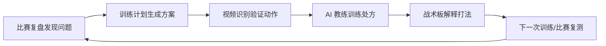
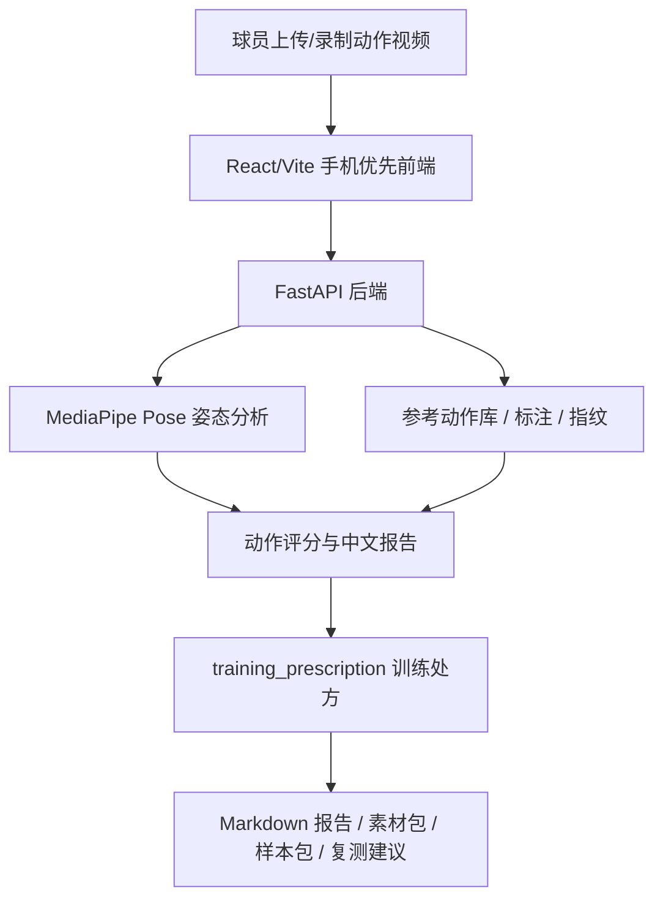

# Agent 流程与主项目架构

## 产品闭环

## 主项目架构

## Agent 决策链

当前版本使用可解释规则 Agent，而不是直接依赖外部大模型：

1. 读取球员意图：训练目标或用户输入的改善方向。
2. 提取视频证据：动作类型、总评分、阶段弱项、一致性、拍摄质量。
3. 选择训练模块：从动作类型、弱项和目标映射到下一组训练。
4. 生成训练处方：诊断、原因假设、训练结构、验收标准、下次拍摄提示。
5. 复测闭环：下一段视频继续验证同一个变化。

## 为什么先用规则 Agent

- 低成本：Demo 不依赖云端大模型也能稳定运行。
- 可解释：面试官能看到每一步为什么这么建议。
- 可替换：后续可以把 `training_prescription` 接入 LLM，让大模型负责语言润色和多轮追问。
- 适合创业公司：先把闭环跑通，再逐步智能化。

## 后续 LLM 接入点

- 球员画像追问：自动补齐水平、伤病、训练条件。
- 报告润色：把规则结果改写成更像真人教练的语气。
- 训练计划联动：把处方同步到“网球训练计划”小程序。
- 比赛复盘联动：从“网球记分复盘”读取问题项，自动选择训练模块。
